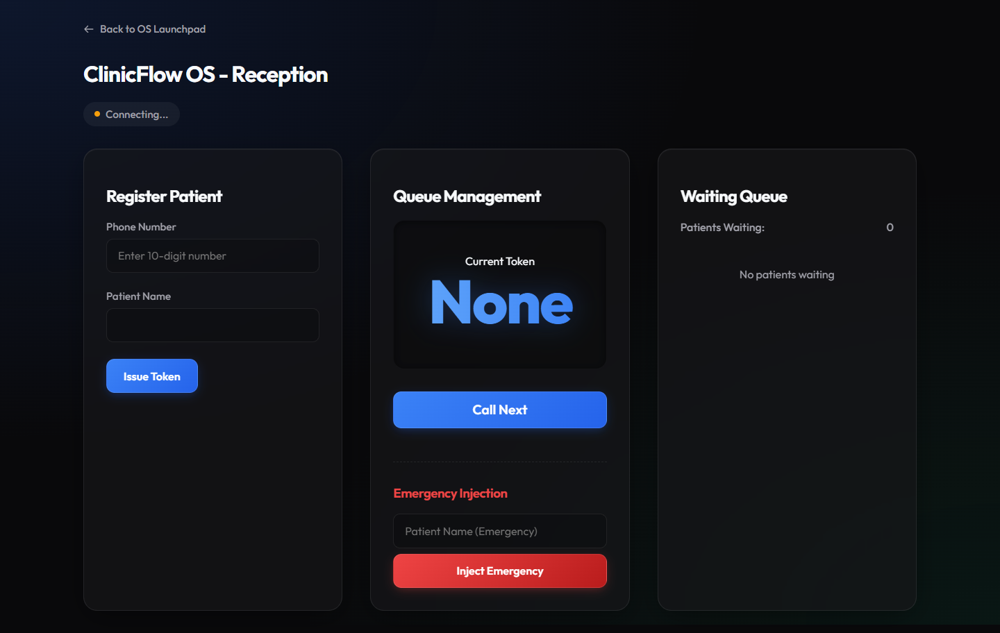
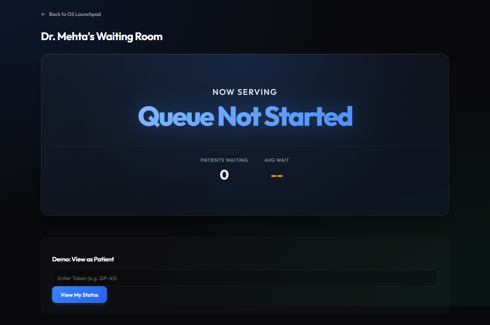
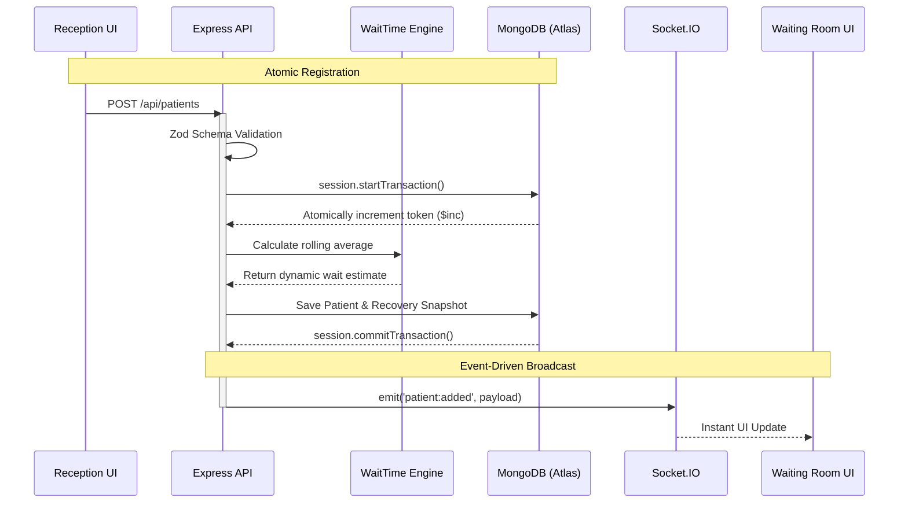

# ClinicFlow OS


**ClinicFlow OS** is an event-driven, real-time queue management system designed to eliminate patient anxiety and streamline clinic operations. By replacing physical paper tokens with a synchronized digital ecosystem, it provides clinics with operational transparency and patients with mathematically sound, live wait-time estimates.

🌍 **[Live Production Demo](https://clinic-os-y0w8.onrender.com/)**

---

## 📸 System Previews

| Receptionist Dashboard | Waiting Room Display |
|:---:|:---:|
|  |  |

---

## 🎯 The Problem vs. The Solution

**The Problem:** Traditional clinics operate as a "black box." Patients are handed a piece of paper and left to sit in a crowded room with zero visibility into how long they will actually wait. This leads to desk crowding, patient frustration, and high abandonment rates.

**The Solution:** ClinicFlow OS acts as the central nervous system for the clinic. 
- **For Receptionists:** A lightning-fast, zero-friction interface to register patients, inject emergencies, and call the next token.
- **For Patients:** A beautiful, real-time waiting room display that dynamically recalculates wait times based on a rolling average of actual consultation lengths.
- **For Owners:** A high-level analytics dashboard tracking operational efficiency.

---

## 🏗️ Architectural Highlights

This system is built with **production-grade engineering patterns** to ensure absolute reliability in a high-stakes healthcare environment:

- **ACID MongoDB Transactions:** Token generation and patient registration are wrapped in native MongoDB sessions. This guarantees mathematically perfect, atomic sequence numbering with zero risk of "gaps" or race conditions under concurrent load.
- **Strict Payload Validation:** All incoming requests pass through a strict `Zod` middleware schema to prevent malformed data and NoSQL injection before hitting the controllers.
- **Atomic Crash Recovery:** The system writes continuous state snapshots to the database. If the server crashes or restarts, the `RecoveryService` instantly reconstructs the queue position and wait times, ensuring zero data loss.
- **Event-Driven Real-Time Sync:** Utilizing `Socket.IO` with dynamic room isolation (`clinic_X_doctor_Y`), state changes are pushed to connected clients with sub-millisecond latency without polling the database.
- **Algorithmic Wait Times:** Wait estimates are not hardcoded. The `WaitTimeEngine` dynamically adjusts predictions based on the rolling average of the doctor's actual consultation durations.

---

## 🗺️ System Architecture



---

## 🚀 Quick Start (Local Setup)

To run ClinicFlow OS locally:

### 1. Prerequisites
- Node.js (v18+)
- MongoDB Atlas Cluster (or local MongoDB instance)

### 2. Installation
```bash
# Clone the repository
git clone https://github.com/ramakrishnanyadav/Clinic_OS.git
cd Clinic_OS

# Install dependencies
npm install

# Configure Environment Variables
cp .env.example .env
# Edit .env and insert your MONGO_URI
```

### 3. Run the OS
```bash
# Start the Node server
npm start
```

### 4. Access the Dashboards
- **OS Launchpad:** `http://localhost:3000/`
- **Reception:** `http://localhost:3000/reception/index.html`
- **Waiting Room:** `http://localhost:3000/waiting/index.html`
- **Owner Dashboard:** `http://localhost:3000/owner/index.html`

---

## 🛠️ Technology Stack

- **Backend:** Node.js, Express.js
- **Database:** MongoDB (Mongoose)
- **Real-Time Engine:** Socket.IO
- **Validation:** Zod
- **Frontend:** Vanilla HTML5, CSS3 (Glassmorphism UI), JavaScript (ES6 Modules)

---

*Built for operational excellence and patient peace of mind.*
